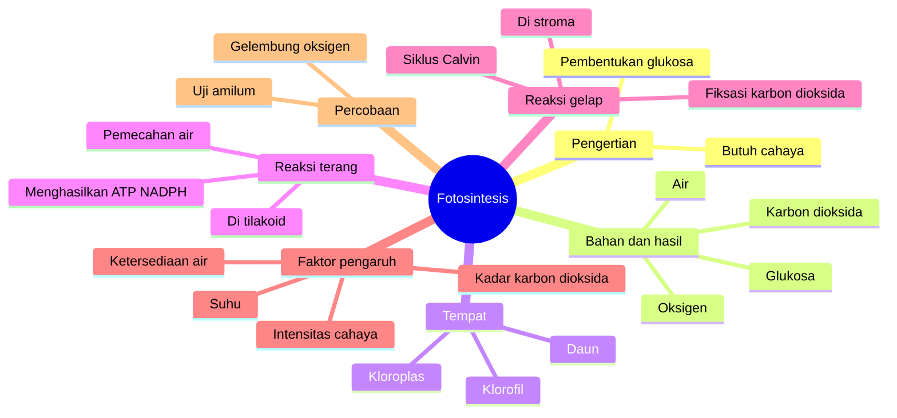

# Eval 4 — Mind map fotosintesis untuk ujian biologi SMA

Prompt: "Buatkan mind map untuk belajar materi fotosintesis buat ujian biologi SMA, saya tidak punya materinya."

Klasifikasi: id · Genre F (Belajar) · pembaca: pelajar SMA · **mode: Dari nol** (kamu tidak memberi materi) · kedalaman: Cepat.

**Mode dari nol.** Peta ini disusun dari cakupan umum materi fotosintesis SMA, bukan dari buku atau catatan gurumu. Seluruh peta `[CEK: cocokkan dengan silabus/kisi-kisi/buku paket dari guru]`. Tidak ada angka, tahun, atau nama tokoh yang dicantumkan.

---

## 1. Peta inti

| Node | Isi |
|---|---|
| Should | Bisa menjelaskan pengertian, bahan & hasil, tempat, dua tahap reaksi, dan faktor yang memengaruhi fotosintesis, serta membaca soal percobaan |
| Is | Belum punya materi `[ISI: bagian yang sudah dipahami]` |
| Gap | Seluruh konsep inti fotosintesis dan cara menjawab soal percobaan |
| Action | Latihan dengan pertanyaan uji diri, lalu cocokkan dengan kisi-kisi |

## 2. Kerangka (mind map)

**Hubungan penting**
- Reaksi terang menyediakan ATP dan NADPH yang dipakai reaksi gelap; tanpa cahaya, reaksi gelap lama-lama berhenti.
- Oksigen yang dilepas berasal dari pemecahan air di reaksi terang, bukan dari karbon dioksida.
- Faktor pengaruh bekerja pada tahap tertentu: cahaya terutama pada reaksi terang, kadar karbon dioksida pada reaksi gelap, suhu pada kerja enzim.
- Percobaan uji amilum dan gelembung oksigen adalah cara membuktikan hasil fotosintesis.

**Yang sering tertukar**
- Reaksi terang vs reaksi gelap: tempat (tilakoid vs stroma), bahan, hasil.
- "Reaksi gelap" bukan berarti terjadi hanya saat gelap.
- Kloroplas (organel) vs klorofil (pigmen).
- Fotosintesis vs respirasi: bahan dan hasilnya berkebalikan.

**Pertanyaan uji diri** (tingkat Bloom revisi, Anderson & Krathwohl 2001)

| No | Tingkat | Pertanyaan |
|---|---|---|
| 1 | Mengingat | Sebutkan bahan dan hasil fotosintesis. |
| 2 | Mengingat | Di bagian kloroplas mana reaksi terang terjadi? |
| 3 | Memahami | Jelaskan kenapa oksigen hasil fotosintesis berasal dari air. |
| 4 | Memahami | Bedakan reaksi terang dan reaksi gelap dari tempat, bahan, dan hasil. |
| 5 | Menerapkan | Tanaman ditaruh di ruang gelap dua hari lalu diuji amilum. Apa hasilnya dan kenapa? |
| 6 | Menerapkan | Pada percobaan tanaman air, lampu didekatkan. Apa yang terjadi pada jumlah gelembung? |
| 7 | Menganalisis | Grafik laju fotosintesis naik lalu mendatar saat cahaya ditambah. Faktor apa yang membatasi di bagian datar? |
| 8 | Menganalisis | Kenapa laju fotosintesis turun pada suhu terlalu tinggi? |

**Jawaban** (tutup dulu saat latihan)
1. Bahan: karbon dioksida dan air (dengan cahaya); hasil: glukosa dan oksigen.
2. Membran tilakoid (grana).
3. Oksigen dilepas saat molekul air dipecah pada reaksi terang.
4. Terang: tilakoid, butuh cahaya dan air, hasil ATP, NADPH, oksigen. Gelap: stroma, pakai karbon dioksida, ATP, NADPH, hasil glukosa.
5. Umumnya negatif/sedikit amilum, karena tanpa cahaya tidak terbentuk glukosa baru dan cadangan terpakai.
6. Gelembung bertambah (sampai batas tertentu), karena intensitas cahaya naik.
7. Faktor lain, misalnya kadar karbon dioksida atau suhu, menjadi pembatas.
8. Enzim pada reaksi gelap rusak/kerjanya turun pada suhu terlalu tinggi.

`[CEK: istilah dan kedalaman materi (mis. apakah detail siklus Calvin diujikan) sesuai buku/kurikulum sekolahmu]`

## 3. Hasil cek

| Butir | Status | Perbaikan |
|---|---|---|
| U1 Pembaca spesifik | Lolos | Pelajar SMA persiapan ujian biologi |
| U2 Gap nyata | Lolos | |
| U4 Tidak ada yatim | Lolos | Tiap cabang punya minimal satu pertanyaan uji |
| U8 Tindakan akhir | Lolos | Latihan + cocokkan kisi-kisi |
| U9 Nol fakta karangan | Lolos | Tidak ada angka/tahun/tokoh |
| F5 Mode dinyatakan | Lolos | Dari nol |
| F5 Tidak ada konsep diam-diam di luar materi | Lolos (n/a) | Tidak ada materi pengguna; seluruh peta ditandai `[CEK]` |
| F5 Simpul ≤5 kata; cabang 3–7 | Gagal → diperbaiki | "Menghasilkan ATP dan NADPH" dipendekkan; cabang = 7 |
| F5 Pertanyaan tingkat berbeda | Lolos | 4 tingkat |
| F5 Mermaid valid | Lolos | Satu `root`, indentasi 2 spasi konsisten |

## 4. Opsi judul

1. Fotosintesis: Peta Materi Ujian Biologi SMA
2. Fotosintesis dalam 7 Cabang
3. Dari Cahaya ke Glukosa: Peta Belajar Fotosintesis

## 5. Yang perlu kamu lengkapi

- [ISI: bagian yang sudah kamu pahami, agar latihan fokus]
- [ISI: kisi-kisi ujian jika ada]
- [CEK: cocokkan seluruh peta dengan silabus/RPS/buku paket dari guru]
- [CEK: apakah percobaan (uji amilum, gelembung oksigen) termasuk materi ujian]

Langkah berikutnya: kerjakan pertanyaan 1–8 tanpa melihat jawaban, lalu ulang cabang yang salah dua hari lagi.
