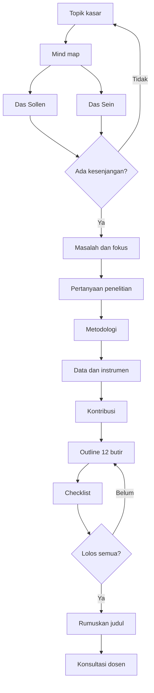

# Genre A — Riset (skripsi, tesis, proposal, artikel jurnal, makalah)

Pola kerja dasar: **mind map → outline 12 butir → checklist → baru judul.**
Pola ini diadaptasi dari video pendek akun dafnisfaz_ ("kenapa harus bikin outline
sebelum ngajuin judul"). Yang diambil hanya urutan dan struktur butir, bukan isi template
berbayarnya.

Contoh berjalan di file ini: *sistem peminjaman alat laboratorium berbasis web dengan
notifikasi surel pada `[Instansi]`* — topik netral rekaan, bukan milik mahasiswa mana
pun. Ganti dengan topik pengguna. Jangan menyalin contoh ini ke keluaran sebagai saran
judul, dan jangan memakai topik dari naskah pengguna lain sebagai contoh.

---

## A1. Mind map (isi sebelum outline)

| Simpul | Pertanyaan pemandu | Contoh (peminjaman alat lab) |
|---|---|---|
| Das Sollen | Idealnya seperti apa menurut teori, norma, regulasi, target? | Alat tercatat, peminjam dan tenggat diketahui, pengembalian tepat waktu |
| Das Sein | Faktanya di lapangan? Dari mana tahunya? | Peminjaman dicatat di buku, alat sering terlambat kembali atau hilang `[ISI: sumber observasi/wawancara laboran]` |
| Kesenjangan → masalah | Apa jarak keduanya, dan kenapa penting? | Tidak ada catatan yang bisa dicari dan tidak ada pengingat tenggat |
| Pertanyaan penelitian | Kata tanya sesuai tujuan (lihat A2) | *Bagaimana* merancang…; *Sejauh mana* keterlambatan pengembalian berkurang… |
| Metodologi | Kuantitatif, kualitatif, R&D/design science, atau campuran? | Rekayasa (design science) + evaluasi kuantitatif |
| Data & metode | Terukur? Bisa dikerjakan dengan waktu dan izin yang ada? | `[ISI: jumlah alat]`, `[ISI: data peminjaman N bulan]` |
| Kontribusi | Untuk teori? Untuk praktik? | Pola pencatatan + pengingat untuk unit layanan kecil; prototipe untuk `[Instansi]` |

Aturan: judul **tidak** ditulis di tahap ini.

Diagram alur (opsional, tampil di GitHub, Obsidian, mermaid.live):

## A2. Pertanyaan penelitian

| Kata tanya | Dipakai untuk | Metode yang biasanya cocok |
|---|---|---|
| Bagaimana (proses/rancangan) | merancang, menjelaskan proses | kualitatif, R&D/design science |
| Bagaimana pengaruh A terhadap B | hubungan variabel | kuantitatif (regresi, eksperimen) |
| Mengapa | penjelasan sebab | kualitatif, studi kasus, mixed |
| Apa (faktor) | identifikasi | kualitatif eksploratif, analisis faktor |
| Sejauh mana | tingkat, dampak, akurasi | kuantitatif, evaluasi |

Uji tiap pertanyaan dengan FINER (Feasible, Interesting, Novel, Ethical, Relevant).
Satu pertanyaan, satu fokus. Setiap pertanyaan dijawab di bab hasil dan pembahasan.

Tujuan penelitian = pertanyaan yang diubah jadi kalimat pernyataan, satu lawan satu.

## Pilih template

- Pengguna minta **proposal**, **cek kesiapan judul**, atau belum mulai penelitian → pakai A3 (12 butir). Jangan tampilkan A4.
- Dalam bahasa Inggris: "thesis proposal", "research proposal", "proposal outline" → A3.
  "full thesis outline", "chapter outline", "thesis structure" → A4. Bila keduanya muncul,
  kata **proposal** menang.
- Pengguna minta **kerangka skripsi/tesis utuh** → pakai A4 (bab), dan isi Bab 3 dengan butir 5–12 dari A3 secara ringkas. Jangan tampilkan dua kerangka terpisah.
- **Artikel jurnal** → IMRaD (akhir A4).
- Skripsi, tesis, dan proposal selalu mode **Lengkap**, kecuali pengguna minta "versi cepat".

## A3. Outline 12 butir (proposal / Bab 1–3)

| No | Butir | Isi wajib | Sumber |
|---|---|---|---|
| 1 | Topik & latar belakang | Das Sollen vs Das Sein, 1–2 paragraf, dengan data atau rujukan | data lapangan dan rujukan bidang pengguna (bukan Kelsen; Kelsen hanya untuk menjelaskan asal istilah bila ditanya) |
| 2 | Tujuan | Satu tujuan per pertanyaan | |
| 3 | Rumusan masalah | Bernomor, spesifik, bisa dijawab metodenya | Creswell & Creswell 2018 |
| 4 | Asumsi filosofis & teori | Worldview (postpositivis, konstruktivis, transformatif, pragmatis) dan teori pemandu | Creswell & Creswell 2018 |
| 5 | Desain | Kuantitatif / kualitatif / mixed / design science. Jenis: deskriptif, korelasional, eksperimen, studi kasus. Waktu: cross-sectional atau longitudinal | Creswell & Plano Clark 2018; Hevner dkk. 2004 |
| 6 | Peran peneliti | Orang dalam/luar, refleksivitas (terutama kualitatif) | |
| 7 | Prosedur pengumpulan data | Siapa, cara rekrut, teknik sampling, alat, jenis data | |
| 8 | Instrumen | Buat sendiri atau adopsi (kutip), jumlah butir, skala (mis. Likert 1–5), validitas, reliabilitas (Cronbach's α), skoring | Likert 1932; Cronbach 1951 |
| 9 | Uji coba (pilot) | Ke kelompok kecil yang mirip target, lalu revisi instrumen. Ukuran pilot `[CEK: pedoman/pembimbing]` | |
| 10 | Jadwal | Penyebaran, batas, follow-up, olah data, penulisan | |
| 11 | Etika & izin | Informed consent, anonimisasi, surat izin, data pribadi | UU 27/2022 (PDP) |
| 12 | Rencana analisis | Response rate → deskriptif → uji instrumen → uji hipotesis/evaluasi → (kualitatif) coding tematik | |

Contoh butir 12 untuk contoh berjalan: fungsi diuji black-box per skenario (pinjam,
kembali, terlambat, notifikasi); keterlambatan pengembalian dibandingkan sebelum dan
sesudah sistem dipakai (uji statistik bila datanya berpasangan — maka hipotesis
perbandingan sah, lihat `uajm-usulan-ta.md` tabel Konsekuensi); kepuasan laboran dan
peminjam dengan kuesioner Likert (Likert 1932).

Catatan ambang: α ≥ 0,70 adalah konvensi yang lazim, bukan aturan baku. Tulis begitu.

## A4. Pemetaan ke struktur bab skripsi Indonesia

Struktur lima bab ini **lazim**, bukan baku. Banyak kampus berbeda (misalnya tinjauan
pustaka digabung ke Bab 1, atau hasil dan pembahasan dipisah). Selalu tambahkan
`[CEK: pedoman penulisan kampus]`.

| Bab lazim | Isi | Dari butir |
|---|---|---|
| Bab 1 Pendahuluan | latar belakang, rumusan masalah, tujuan, manfaat, batasan | 1, 2, 3 |
| Bab 2 Tinjauan Pustaka | teori, penelitian terdahulu (tabel perbandingan), kerangka pemikiran, hipotesis | 4 |
| Bab 3 Metode | desain, populasi/sampel, instrumen, prosedur, analisis, etika | 5–12 |
| Bab 4 Hasil & Pembahasan | jawaban tiap rumusan masalah, berurutan | 3, 12 |
| Bab 5 Penutup | kesimpulan (satu per rumusan), saran (praktis dan untuk penelitian lanjut) | 2, kontribusi |

Untuk artikel jurnal, pakai IMRaD: Introduction, Methods, Results, and Discussion
(Sollaci & Pereira 2004). Cek template jurnal tujuan.

Tabel penelitian terdahulu (Bab 2), kolom yang disarankan:
Peneliti & tahun | Tujuan | Metode | Temuan | Beda dengan penelitian ini.
Isi hanya dengan sumber yang benar-benar ada dan sudah dibaca pengguna. Jika kosong,
tulis `[ISI: minimal N penelitian terdahulu, cari di Google Scholar/SINTA/Garuda]`.

## A5. Checklist mixed methods (hanya jika desainnya campuran)

- [ ] **Alasan**: bukan "biar lengkap". Contoh alasan sah: angka saja tidak menjelaskan
      sebab; atau temuan wawancara perlu diuji ke populasi lebih luas.
- [ ] **Dua sumber data** direncanakan (mis. survei `[ISI: n]` dan wawancara `[ISI: n]`).
- [ ] **Strategi**: explanatory sequential (KUAN → kual), exploratory sequential
      (KUAL → kuan), atau convergent (KUAN + KUAL). Explanatory paling mudah untuk pemula.
- [ ] **Tujuan integrasi** dinyatakan: menjelaskan, membangun instrumen, atau membandingkan.
- [ ] **Diagram prosedur** dengan notasi (huruf besar = prioritas).
- [ ] **Joint display**: Temuan statistik | Kutipan wawancara | Kesimpulan gabungan
      (Fetters dkk. 2013).
- [ ] **Metainferensi**: ada wawasan yang hanya muncul karena data digabung.
- [ ] **Kualitas**: kuantitatif lewat validitas/reliabilitas; kualitatif lewat
      trustworthiness (credibility, transferability, dependability, confirmability;
      Lincoln & Guba 1985).

## A6. Judul (setelah semua lolos)

Pola yang umum dipakai:
`[Luaran/variabel] + [metode/pendekatan bila pembeda] + [objek/konteks] + [lokasi/waktu bila perlu]`

Contoh:
- Rancang Bangun Sistem Peminjaman Alat Laboratorium Berbasis Web dengan Notifikasi Surel pada `[Instansi]`
- Pengaruh `[X]` terhadap `[Y]` pada `[populasi]` di `[lokasi]`
- Studi Kasus `[fenomena]` di `[tempat]`

Hindari di judul: kata "analisis" yang tidak jelas analisis apa, singkatan yang tidak
umum, klaim hasil ("efektif meningkatkan…") sebelum diuji, dan judul lebih dari
`[CEK: batas kata pedoman kampus]`.

## A7. Pemeriksaan khusus riset (tambahan untuk checklist.md)

- [ ] Setiap rumusan masalah punya: tujuan, data, instrumen, teknik analisis, bagian di Bab 4.
- [ ] Variabel/konsep didefinisikan secara operasional (bagaimana diukur).
- [ ] Populasi, sampel, dan teknik sampling disebut, jumlahnya beralasan.
- [ ] Batasan penelitian ditulis (apa yang tidak diteliti).
- [ ] Semua rujukan nyata. Tidak ada `[CEK]` tersisa di rujukan saat dikirim ke dosen.
- [ ] Rencana izin dan etika ada sebelum pengambilan data.
