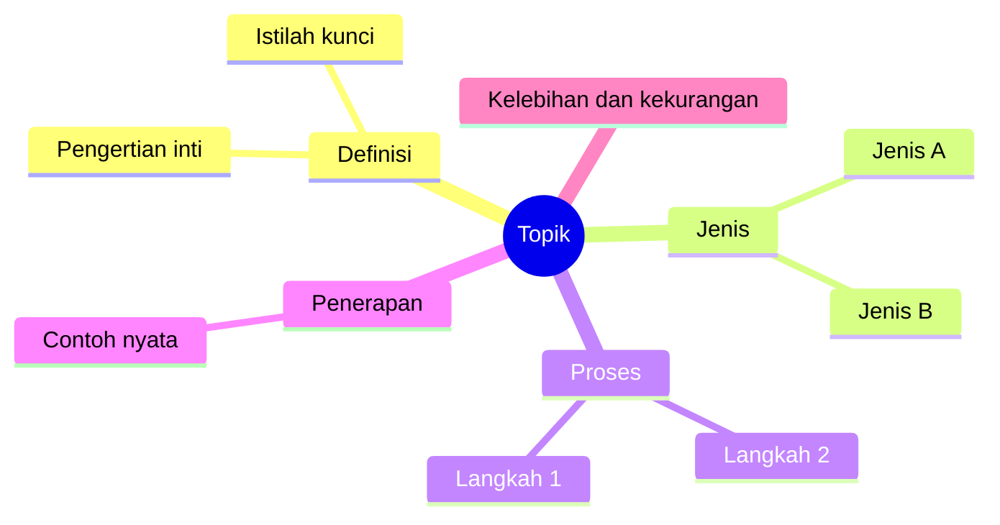

# Genre F — Belajar (mind map materi, ringkasan, persiapan ujian)

Tujuan outline belajar berbeda: bukan meyakinkan orang lain, tapi membuat materi bisa
diingat dan diuji ulang. Peta Should/Is: **Should** = yang harus bisa dijawab saat ujian
(capaian pembelajaran, kisi-kisi, silabus), **Is** = yang sudah dipahami sekarang,
**Gap** = yang harus dipelajari.

## F1. Dua mode

- **Dari materi**: pengguna memberi catatan, slide, atau bab. Struktur diambil hanya dari
  materi itu. Jangan menambah konsep yang tidak ada; jika penting dan umum, tambahkan di
  cabang terpisah berlabel `Tambahan di luar materi`.
- **Dari nol**: pengguna hanya memberi topik. Susun dari silabus umum topik itu, tandai
  seluruh peta `[CEK: cocokkan dengan silabus/RPS dosen]`, dan jangan cantumkan angka,
  tahun, atau nama tokoh yang tidak pasti.

## F2. Struktur mind map

Aturan:
1. Pusat = topik, ditulis sebagai kata benda singkat.
2. Cabang utama 3–7, disusun menurut logika materi: definisi → jenis/komponen → proses →
   penerapan → kelebihan/kekurangan → contoh soal. Pakai yang relevan saja.
3. Setiap simpul maksimal 5 kata. Penjelasan panjang masuk ke catatan di bawah peta.
4. **Teks simpul tanpa tanda kurung (), [], {}** dan tanpa titik dua. Di Mermaid mindmap
   tanda kurung mengubah bentuk simpul dan bisa membuat diagram gagal dirender. Satu-satunya
   pengecualian adalah `root((Topik))`. Indentasi 2 spasi per tingkat, konsisten.
   Ejaan dan tanda hubung istilah milik pengguna dipertahankan apa adanya, mis. `demand-pull`
   tetap `demand-pull`.
5. Hubungan antarcabang (sebab-akibat, lawan) ditulis di catatan, karena Mermaid mindmap
   tidak menggambar garis silang.

Format output:

Setelah peta, tambahkan:
- **Hubungan penting**: 2–5 kalimat yang menghubungkan cabang.
- **Pertanyaan uji diri**: 5–10 pertanyaan, dari mengingat ke menerapkan dan
  menganalisis (mengikuti tingkatan taksonomi Bloom revisi, Anderson & Krathwohl 2001).
  Jawaban disembunyikan di bagian terpisah agar bisa dipakai untuk latihan mengingat.
- **Yang sering tertukar**: pasangan konsep yang mirip dan bedanya.

## F3. Ringkasan bab

1. Satu kalimat inti bab
2. 3–7 poin utama (urutan penulis)
3. Istilah dan definisi (tabel)
4. Contoh dari bab
5. Pertanyaan uji diri

## F4. Rencana belajar menuju ujian

Tabel: Topik | Bobot/kisi-kisi `[ISI]` | Pemahaman sekarang (1–3) | Sesi belajar | Sesi
ulang. Jadwalkan ulang topik yang lemah dengan jarak yang makin panjang (spaced
repetition). Jangan menjanjikan hasil nilai.

## F5. Pemeriksaan khusus belajar

- [ ] Mode (dari materi / dari nol) dinyatakan.
- [ ] Tidak ada konsep yang ditambahkan diam-diam di luar materi.
- [ ] Setiap simpul ≤ 5 kata; cabang utama 3–7.
- [ ] Ada pertanyaan uji diri dengan tingkat berpikir berbeda.
- [ ] Blok Mermaid valid (indentasi konsisten, satu `root`).
